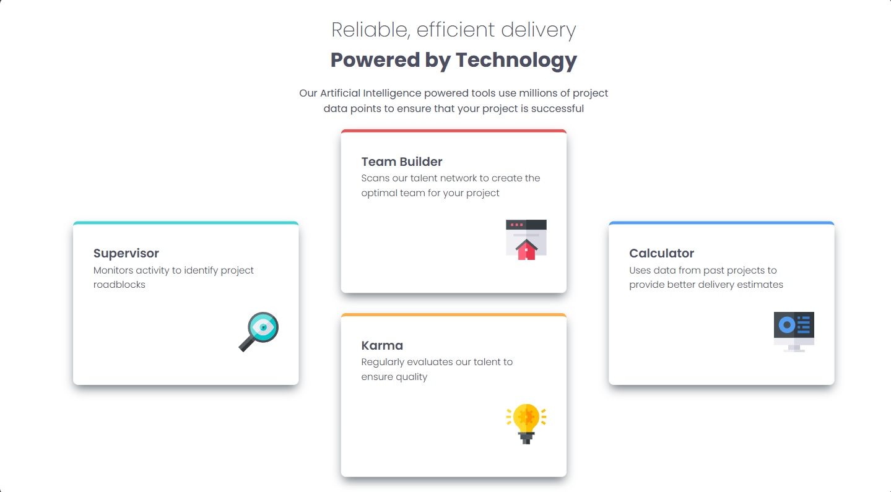

# Frontend Mentor - Four card feature section solution

This is a solution to the [Four card feature section challenge on Frontend Mentor](https://www.frontendmentor.io/challenges/four-card-feature-section-weK1eFYK). Frontend Mentor challenges help you improve your coding skills by building realistic projects. 

## Table of contents

- [Overview](#overview)
  - [The challenge](#the-challenge)
  - [Screenshot](#screenshot)
  - [Links](#links)
- [My process](#my-process)
  - [Built with](#built-with)
  - [What I learned](#what-i-learned)
  - [Continued development](#continued-development)
- [Author](#author)

## Overview

### The challenge

Users should be able to:

- View the optimal layout for the site depending on their device's screen size

### Screenshot



### Links

- Solution URL: [Add solution URL here](https://your-solution-url.com)
- Live Site URL: [Add live site URL here](https://your-live-site-url.com)

## My process

### Built with

- Semantic HTML5 markup
- CSS custom properties
- Flexbox
- CSS Grid
- Mobile-first workflow

### What I learned

Focused heavily on responsiveness and wanted to ensure a fluidity of the elements across different device screen sizes experimenting around with different functions inside CSS for it to achieve the look and feel desired.

The main block with the content inside was made responisve using the clamp() function in CSS for better scalability and fluidity.

```css
main {
    display:flex;
    flex-direction: column;
    margin: auto;
    width: clamp(1000px, 1200px + 3vw, 90vw);
    height: 750px;
    font-family: "Poppins", sans-serif;
    color: hsl(234, 12%, 34%);
}
```

Same was done with the card elements. Grant more fluidity to the elements using the clamp() function having a minimum size, ideal size scaling with viewport width and a maximum size for this cards.
```css
.card {
    width: clamp(300px, 300px + 4vw, 450px);
    height: 260px;
    background-color: hsl(0, 0%, 100%);
    border-radius: 0.5em;
    box-shadow: 0 0.5em 1em -0.2em hsl(212, 6%, 44%);
    padding: 2em;
    margin: auto;
}
```

### Continued development

Continue experimenting with other functions and keeping in mind responsiveness and fluidity throughout my future projects.

## Author

- GitHub - [winceh7](https://github.com/winceh7)
- Frontend Mentor - [@winceh7](https://www.frontendmentor.io/profile/winceh7)